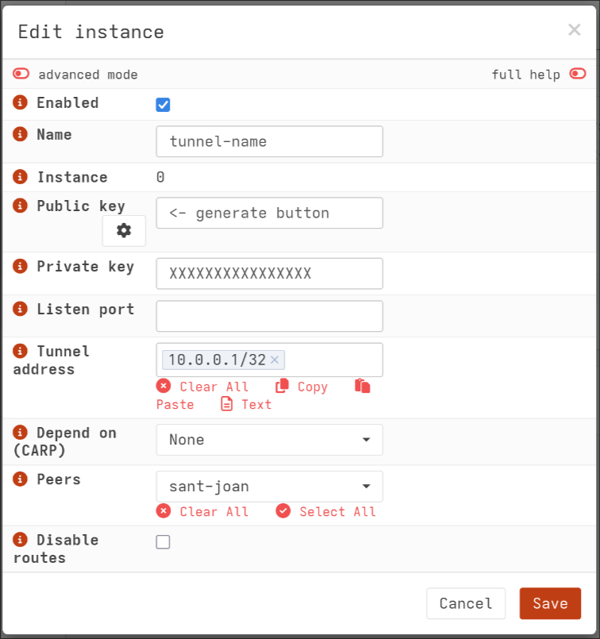
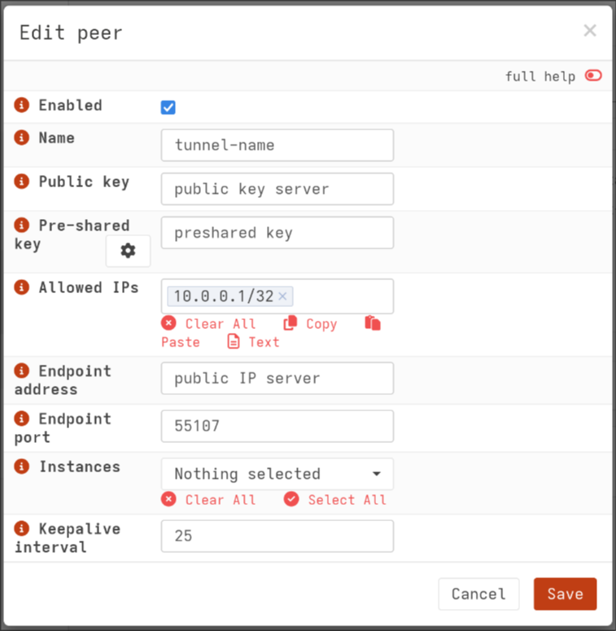

# Wireguard-VPS-Tunnel
Short description to bypass CgNAT with wireguard and some virtual server in the cloud to self host services from home. This guide is based on this [Reddit post](https://www.reddit.com/r/unRAID/comments/10vx69b/ultimate_noob_guide_how_to_bypass_cgnat_using/?show=original). Be aware the guide is written as `root` user it is not recommended to execute the commands directly as `root`.

# Cloud server configuration
In this section the wireguard configuration for the server in the cloud with a static IPv4-address is described.
The virtual server has the following specs:
 - 1 virtual CPU core
 - 1GB of RAM
 - public static IPv4 Address
 - Ubuntu Server 24.04.1 LTS
 - `ssh` access configured
 - `root` or `sudo` user
## Install wireguard
```
apt install wireguard 
```
## Setup wireguard and required keys
Write private key in wireguard config `/etc/wireguard/wg0.conf` and generate publickey `/etc/wireguard/publickey`
```
wg genkey | sudo tee -a /etc/wireguard/wg0.conf | wg pubkey | tee /etc/wireguard/publickey
```
Optional you can create a `presharedkey` (psk) one one of the devices. This key is the **same** for both devices, it is required to make the tunnel post-quantum secure:
```
wg genpsk > presharedkey
```
After that edit the wireguard config `/etc/wireguard/wg0.conf` with you prefered editor. The config should look like the following:
```
[Interface]
PrivateKey = <private key of server, should be already here>
ListenPort = 55107
Address = 10.0.0.1

[Peer]
PublicKey = <public key of homeserver, see next section>
PresharedKey = <content of presharedkey>
AllowedIPs = 10.0.0.2/32
```
In the next step you have to uncommend following line in `/etc/sysctl.conf`:
```
#...
net.ipv4.ip_forward=1
...
```
and execute the following command to enable the configuration:
```
sysctl --system
```
# Configuration of private home server
In this section the wireguard configuration of the private home server is described. The server at home in this case is a VM managed by Proxmox.
The virtual server has the following specs:
 - 2 virtual CPU core
 - 2GB of RAM
 - private local IPv4-address
 - RockyLinux 9.4
 - `ssh` access configured
 - `root` or `sudo` user
## Install wireguard
```
dnf install wireguard-tools
```
Write private key in wireguard config `/etc/wireguard/wg0.conf` and generate publickey `/etc/wireguard/publickey`, same as on the public server.
```
wg genkey | sudo tee -a /etc/wireguard/wg0.conf | wg pubkey | tee /etc/wireguard/publickey
```
After that edit the wireguard config `/etc/wireguard/wg0.conf` with you prefered editor. The config should look like the following:
```
[Interface]
PrivateKey = <private key of server, should be already here>
Address = 10.0.0.2

[Peer]
PublicKey = <public key of the cloud server>
PresharedKey = <content of presharedkey>
AllowedIPs = 10.0.0.1/32
Endpoint = <your public IPv4-address of the cloud server>:55107
PersistentKeepalive = 25
```
If you completed this section and the cloud server section, you should be able to ping between your two instances.
```
ping 10.0.0.1
```
... on the home server or:
```
ping 10.0.0.2
```
... on the cloud server.

# Further configuration on the cloud server to host a website
To host a website for example an instance of `nginx` you have to do some further configuration on the cloud server, you may have to install `iptables` depending on you Linux distribution.
```
iptables -P FORWARD DROP
iptables -A FORWARD -i eth0 -o wg0 -p tcp --syn --dport 80 -m conntrack --ctstate NEW -j ACCEPT
iptables -A FORWARD -i eth0 -o wg0 -p tcp --syn --dport 443 -m conntrack --ctstate NEW -j ACCEPT
iptables -A FORWARD -i eth0 -o wg0 -m conntrack --ctstate ESTABLISHED,RELATED -j ACCEPT
iptables -A FORWARD -i wg0 -o eth0 -m conntrack --ctstate ESTABLISHED,RELATED -j ACCEPT
iptables -t nat -A PREROUTING -i eth0 -p tcp --dport 80 -j DNAT --to-destination 10.0.0.2
iptables -t nat -A PREROUTING -i eth0 -p tcp --dport 443 -j DNAT --to-destination 10.0.0.2
iptables -t nat -A POSTROUTING -o wg0 -p tcp --dport 80 -d 10.0.0.2 -j SNAT --to-source 10.0.0.1
iptables -t nat -A POSTROUTING -o wg0 -p tcp --dport 443 -d 10.0.0.2 -j SNAT --to-source 10.0.0.1
```
Be aware that you may have to change the interface name `eth0` to something like `ens7` and the IP-addresses may differ. To make the config persistend install the following packages and execute the commands:
```
apt install netfilter-persistent
netfilter-persistent save
apt install iptables-persistent
systemctl enable netfilter-persistent
```

## Host a Minecraft server
If you run a VM to host a Minecraft server you have to add the following configuration:
```
iptables -t nat -A PREROUTING -p tcp -d <public-ip> --dport 25565 -j DNAT --to-destination 10.0.0.2:25565
iptables -t nat -A POSTROUTING -d 10.0.0.2 -p tcp --dport 25565 -j MASQUERADE
iptables -A FORWARD -i eth0 -o wg0 --dst 10.0.0.2 -p tcp --dport 25565 -j ACCEPT

```
In some cases it maybe better to use the rules from above instead of `MASQUERADE` or to introduce static routing to not mask the IP-addresses of the users.
You may change some firewall settings to allow port `25565`.
# Firewall settings on cloud server (Ubuntu)
Install `ufw`:
```
apt install ufw
```
Enable firewall and open wireguard port `55107`:
```
ufw allow 55107
ufw enable
ufw status
```
# Remarks
Your IPv4-address of you wireguard network must differ from you IPv4-Address of your local network.
This guide is based on [this Reddit post](https://www.reddit.com/r/unRAID/comments/10vx69b/ultimate_noob_guide_how_to_bypass_cgnat_using/?show=original)
Some configuration is also from [here](https://gist.github.com/Quick104/d6529ce0cf2e6f2e5b94c421a388318b)
Ubuntu firewall [guide](https://linuxconfig.org/ubuntu-24-04-firewall-a-quick-guide)

# Alternative Config
In this alternative config is the following scenario documented:
```
┌───────────────────────────────┐
│             VPS               │
│         (public IP)           │
└─────────────┬─┬───────────────┘
              | │ Wireguard Tunnel
              | │ all udp/tcp traffic except :22/tcp :55107/udp
               ▼
┌───────────────────────────────┐
│        OPNsense Firewall      │
│        (routing / NAT)        │
└───────────────┬───────────────┘
                │
                │  HTTP / HTTPS / whatever you want
                ▼
┌───────────────────────────────┐
│       NGINX Reverse Proxy     │
│       (virtual hosts, SSL)    │
└───────────────────────────────┘
```
*This graphic is generated with the help of ChatGPT 5.1 Thinking*

Here all traffic except `:22/tcp` (ssh) and `:55107/udp` (wireguard) is forwarded without masking to an NGINX revers proxy behind an OPNSense firewall. The Tunnel is going from the VPS to the OPNSense firewall, the firewall handles the forwarding of allowed traffic to the reverse proxy.

## Wireguard VPS setup
See above
## OPNSense VPN setup
## OPNSense
Instead of a gateway virtual machine you can also use OPNSense to manage the tunnel. The following two screenshots show how you need to configure the tunnel there:


On the peer select the previousely created instance in the dropdown.
## IPTables rules

